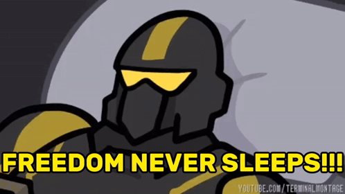

#### If you have any question please open issue on JE-Chen/JE-chen repo.

* HI I'm JeffreyChen, you can call me JE-Chen.
  * My tasks kanban https://github.com/orgs/Integration-Automation/projects/2/views/1
  * If you want to see my repo, click organization.
  * 📧 Mail : jechenmailman@gmail.com | zenmailman@gmail.com 

* Interesting in below
  * Automation framework design.
  * Automation tool design.
  * Design tool platform. 
  * DevOps.
  * Generative AI.
  * Game design.
  
[If you have any question, Open the issue on this repo](https://github.com/JE-Chen/JE-Chen/issues)

---
### Analysis

---
### Discord
https://discordapp.com/users/440905661774168064
(Please DM me "From Github" if you want to add Discord friend)

---
### Steam
https://steamcommunity.com/id/jechen45/
(Please DM me "From Github" if you want to add Steam friend)

